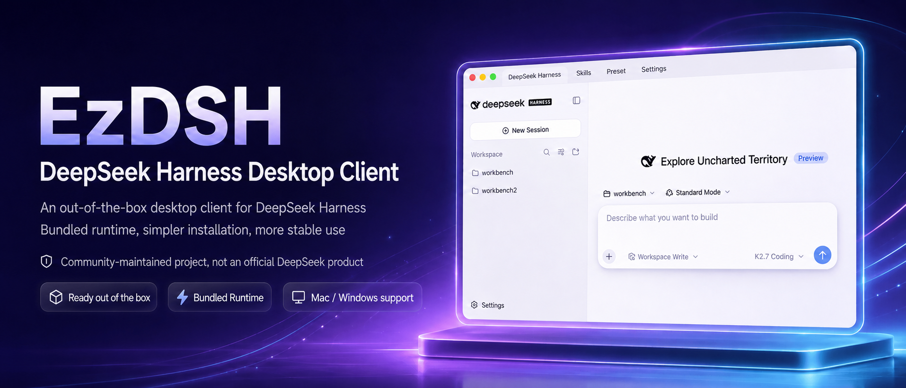

# EzDSH

<p align="center">
  
</p>

<p align="center">
  <strong>An open DeepSeek Harness distribution for macOS and Windows.</strong><br/>
  A personal AI entry point with a bundled Runtime, an extensible plugin ecosystem, remote operation, and integrated workspaces.
</p>

<p align="center">
  <a href="#mission-vision-and-values">Mission & Values</a> •
  <a href="#why-ezdsh">Why EzDSH</a> •
  <a href="#local-use">Local Use</a> •
  <a href="#build-from-source">Build from Source</a> •
  <a href="README.zh-CN.md">中文版</a>
</p>

---

## Mission, Vision, and Values

### Mission

> **Make technology equitable.**

### Vision

> **Give everyone an AI entry point for work and life, turning frontier technology into capabilities that are directly usable, composable, and continuously improving.**

### Values

- **Do no harm**: Technology must serve people. We do not profit from information gaps, technical gaps, or user trust, and never at the expense of users' safety, privacy, or autonomy.
- **Value before technology**: We measure ourselves by the real problems we solve and the real value we create—not by how impressive the technology looks.
- **Usable by everyone**: Users should not have to become technical experts first. Complex capabilities should feel natural to use.
- **Open and composable**: Models, plugins, tools, and workflows should be freely connected, replaced, and extended.
- **Autonomous and trustworthy**: Users retain control over their data, configuration, tools, and final decisions.
- **Co-build with users**: We grow through real-world use and continuous feedback.

## Why EzDSH

DeepSeek Harness is a powerful open agent foundation, but using it locally can mean installing runtimes, starting services from the terminal, managing ports, editing provider configs, and keeping processes alive. EzDSH is more than a desktop wrapper: it is a user-facing distribution built around DeepSeek Harness.

EzDSH packages the Runtime, curates a plugin ecosystem, connects remote operation and integrated workspaces, and turns complex capabilities into tools people can use in everyday work and life.

> **EzDSH brings DeepSeek Harness out of the repository and into a usable entry point for real life.**

## What you get

### Install and run, no environment setup

EzDSH ships with a fixed-version DeepSeek Harness Runtime. You do not need to install Node.js, pnpm, or the Harness CLI yourself. The app creates the workspace, picks a local port, starts the runtime, and loads the Harness Web UI automatically.

Plugin installation is handled by EzDSH’s distribution layer as well. The app uses its bundled DSH Runtime and pnpm, automatically handles known Profile workspace compatibility issues, and verifies that the plugin was added to the target Profile. You do not need to copy commands or add compatibility flags manually.

### Full runtime lifecycle management

EzDSH is not a browser wrapper. It manages the complete Runtime lifecycle:

- Automatic startup and graceful shutdown
- Health checks and readiness detection
- Port conflict detection and retry
- Startup timeout handling
- Crash recovery and restart
- Runtime log collection and viewing
- No orphaned background processes

You see a stable desktop app, not a collection of terminal windows.

### An extensible distribution layer

EzDSH makes DeepSeek Harness more than a runtime. It provides a place to discover, install, combine, and use capabilities built around DSH:

- Plugin marketplace and curated capabilities
- Remote operation
- Integrated workspaces for connecting tools, workflows, and services
- A growing ecosystem that can evolve with users' needs

### DSH-native configuration

EzDSH starts the DSH Runtime directly and leaves provider configuration to the Harness Web UI. EzDSH's own provider setup page is currently hidden so the first release can focus on reliable startup and packaging; the desktop configuration flow will be added in a later version.

### Local-first and security-minded

Your keys, sessions, profiles, plugins, and logs stay on your machine.

- API keys never enter renderer storage
- API keys never appear in ordinary logs
- Credentials are saved with restricted permissions
- Renderer is isolated from the file system and Node.js APIs
- Runtime only listens on `127.0.0.1`

EzDSH is built for users who want to keep their model calls and work data under their own control.

### Upgrades that respect your data

App code, Runtime, and user data are kept separate. Updating EzDSH replaces the client and runtime without touching your:

- Configuration
- Sessions
- Profiles
- Plugins
- Logs
- Local workspace data

You do not rebuild your environment every time the app updates.

### A user-facing distribution for Harness

DeepSeek Harness provides the agent runtime, model calls, tool execution, and core Web UI. EzDSH adds the distribution and product layer that makes those capabilities approachable:

- Installer and first-run onboarding
- Visual provider and profile management
- Process supervision and error recovery
- Local data and log management
- Built-in update delivery
- Security boundaries
- Plugin discovery and installation
- Remote access and integrated workspaces

Harness provides the core. EzDSH makes it usable, extensible, and accessible.

## Who it is for

- Developers who want to run DeepSeek Harness locally
- AI users who prefer not to live in the terminal
- People who want to use frontier AI without becoming infrastructure experts
- Users who switch between multiple model providers
- Anyone who wants API keys and project data kept local
- Professionals who need a stable entry point for agent, tool, plugin, and workspace workflows

## Local use

### Option A: Use the installed app

These steps are for users who only want to use EzDSH. You do not need Node.js, pnpm, or a terminal.

1. Open the [Releases](../../releases) page.
2. Download the installer for your platform:
   - macOS Apple Silicon: `.dmg`
   - Windows x64: `.exe`

   Download these files from the release asset list. GitHub Actions' `Artifacts` are build archives wrapped in ZIP format and are intended for CI inspection, not normal installation.
3. Install EzDSH:
   - On macOS, open the `.dmg` and drag `EzDSH.app` to `Applications`.
   - On Windows, run the `.exe` installer and follow the prompts.
4. Open EzDSH from `Applications` or the Start menu.
5. Configure your model provider in the Harness Web UI.
6. Start working. EzDSH launches the Runtime and opens the Harness workspace automatically.

### Option B: Run from source

These steps are for developers who want to run the project locally from a source checkout. This is different from building an installer.

1. Install Node.js `24.18.0` (or a version accepted by `package.json`).
2. Open a terminal and enter the project directory:

   ```bash
   cd /Users/snake/Documents/ChatGPT/ezdsh
   ```

3. Install project dependencies. Run this once after cloning, or whenever dependencies change:

   ```bash
   npm ci
   ```

4. `npm ci` installs the pinned published `@deepseek-ai/dsh@0.1.1-rc.2` Runtime and its production dependency closure. No separate DSH workspace install or staging step is required.

   To explicitly develop against the vendored DSH source instead, build that source checkout and set `EZDSH_DSH_SOURCE` to its built CLI package:

   ```bash
   npm run dsh:source:install
   npm run dsh:source:build
   EZDSH_DSH_SOURCE="$PWD/vendor/deepseek-harness/apps/cli" npm run dev
   ```

5. Start the local development app:

   ```bash
   npm run dev
   ```

6. Use the Harness Web UI opened by EzDSH. Press `Ctrl+C` in the terminal to stop the development app.

## Build from source

### macOS (Apple Silicon)

These steps are for developers who need to create a distributable installer or release package.

1. Use a macOS Apple Silicon machine and install Node.js `24.18.0` (or a version accepted by `package.json`).
2. Open a terminal and enter the project directory:

   ```bash
   cd /Users/snake/Documents/ChatGPT/ezdsh
   ```

3. Install project dependencies:

```bash
npm ci
```

4. Create the signed release packages:

```bash
npm run package:mac:release
```

This builds the bundled DSH Runtime, creates a signed DMG, and verifies the packaged Runtime. A valid `Developer ID Application` certificate is required. The artifacts are written to `dist/`.

5. To install the DMG, open it and drag `EzDSH.app` into `Applications`. Opening `dist/mac-arm64/EzDSH.app` directly is useful for local development, but does not test the DMG installation or Gatekeeper flow.

### Windows (x64)

1. Use a native Windows x64 machine and install Node.js `24.18.0`.
2. Open PowerShell and enter the project directory:

   ```powershell
   cd C:\path\to\ezdsh
   ```

3. Install project dependencies:

```powershell
npm ci
```

4. Create the Windows installer:

```powershell
npm run package:win
```

This stages the Windows Node Runtime, builds the DSH Runtime with Windows-native dependencies, creates an NSIS installer, and verifies the unpacked bundle. The installer is written to `dist/`.

5. For a signed release build, configure a Windows code-signing certificate and run:

```powershell
npm run package:win:release
```

Windows packaging is prepared for x64 only. It is not executed on the current macOS development machine.

## Download

| Platform | Package |
|----------|---------|
| macOS (Apple Silicon) | `.dmg` |
| Windows | `.exe` installer |

EzDSH checks for updates automatically and notifies you when a new release is available.

For normal installation, download the `.dmg` or `.exe` directly from a GitHub Release.

## License

EzDSH is released under the [MIT License](./LICENSE).

---

<p align="center">
  <sub>Built for the DeepSeek Harness community.</sub>
</p>
