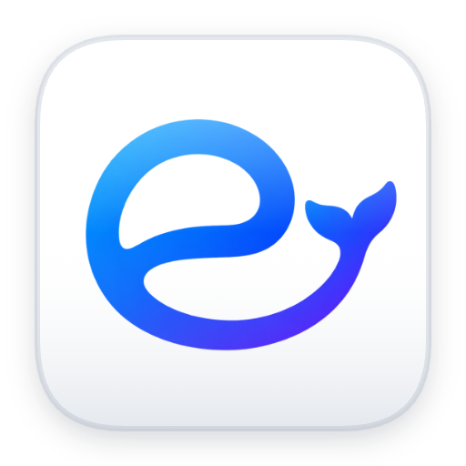

# EzDSH

<p align="center">
  
</p>

<p align="center">
  <strong>真正开箱即用的 DeepSeek Harness 桌面工作台。</strong><br/>
  让 DeepSeek Harness 从“开发者工具”变成“开箱即用的本地 AI 工作台”。
</p>

<p align="center">
  <a href="#为什么选择-ezdsh">为什么选择</a> •
  <a href="#本地使用">本地使用</a> •
  <a href="#从源码编译">从源码编译</a> •
  <a href="README.md">English</a>
</p>

---

## 为什么选择 EzDSH

DeepSeek Harness 功能强大，但在本地跑起来往往需要安装运行环境、从命令行启动服务、管理端口、编辑供应商配置、维持后台进程。EzDSH 把这一整套流程封装成一个桌面应用，让你专注于用 AI 创造价值，而不是和环境配置作斗争。

> **EzDSH 让 DeepSeek Harness 像一个成熟产品，而不是一份 setup 教程。**

## 你能获得什么

### 安装即用，无需配置环境

EzDSH 内置固定版本的 DeepSeek Harness Runtime。你无需提前安装 Node.js、pnpm 或 Harness CLI。应用会自动创建工作目录、分配本地端口、启动 Runtime、加载 Harness Web UI。

### 完整的 Runtime 生命周期管理

EzDSH 不只是一个浏览器外壳，它管理 Runtime 的完整生命周期：

- 自动启动与优雅关闭
- 健康检查与就绪检测
- 端口冲突检测与自动重试
- 启动超时处理
- 崩溃恢复与重启
- 运行日志收集与查看
- 防止留下孤儿进程

你看到的是一个稳定的桌面应用，而不是一堆终端窗口。

### 使用 DSH 自带配置

EzDSH 会直接启动 DSH Runtime，并将供应商配置交给 Harness Web UI。当前版本暂时隐藏 EzDSH 自己的供应商配置页面，先保证启动和发布链路稳定；桌面端配置流程将在后续版本加入。

### 本地优先，重视安全

API Key、Session、Profile、Plugin 和日志都保存在本地，不依赖额外的云端后台。

- API Key 不进入 Renderer 本地存储
- API Key 不写入普通日志
- 凭据文件使用受限权限保存
- Renderer 与文件系统、Node.js API 隔离
- Runtime 仅监听本机 `127.0.0.1`

EzDSH 适合希望把模型调用和工作数据掌控在自己手中的用户。

### 升级不破坏用户数据

应用代码、Runtime 和用户数据相互分离。升级 EzDSH 只会替换客户端和 Runtime，不会删除你的：

- 配置
- Session
- Profile
- Plugin
- 日志
- 本地工作数据

每次更新后，你无需重新配置整个工作环境。

### 为 Harness 加上产品化入口

DeepSeek Harness 负责 Agent Runtime、模型调用、工具执行和 Web UI；EzDSH 则补足桌面产品所需的体验层：

- 安装包与首次启动引导
- 可视化供应商与 Profile 管理
- 进程守护与错误恢复
- 本地数据与日志管理
- 应用内自动更新
- 安全边界

Harness 提供引擎，EzDSH 提供体验。

## 适合谁

- 想在本地运行 DeepSeek Harness 的开发者
- 不想长期泡在命令行里的 AI 用户
- 需要在多个模型供应商之间切换的用户
- 希望 API Key 和项目数据本地保存的用户
- 需要稳定桌面入口的 Agent、工具和 Plugin 使用者

## 本地使用

### 方式一：使用已安装的应用

以下步骤适合只想使用 EzDSH 的普通用户，不需要安装 Node.js、pnpm，也不需要使用命令行。

1. 打开 [Releases](../../releases) 页面。
2. 下载对应平台的安装包：
   - macOS Apple Silicon：`.dmg`
   - Windows x64：`.exe`

   请从 Release 的附件列表下载这些文件。GitHub Actions 的 `Artifacts` 会被 GitHub 统一包装成 ZIP，它们用于 CI 构建归档，不是普通用户的安装入口。
3. 安装 EzDSH：
   - macOS：打开 `.dmg`，将 `EzDSH.app` 拖入“应用程序”文件夹。
   - Windows：运行 `.exe` 安装程序，按照提示完成安装。
4. 从“应用程序”或开始菜单打开 EzDSH。
5. 在 Harness Web UI 中配置模型供应商。
6. 开始工作。EzDSH 会自动启动 Runtime 并打开 Harness 工作空间。

### 方式二：从源码本地运行

以下步骤适合希望从源码运行项目的开发者。这和生成安装包是两件不同的事情。

1. 安装 Node.js `24.18.0`（或 `package.json` 接受的版本）。
2. 打开终端，进入项目目录：

   ```bash
   cd /Users/snake/Documents/ChatGPT/ezdsh
   ```

3. 安装项目依赖。首次克隆项目后执行一次；依赖发生变化时也需要重新执行：

   ```bash
   npm ci
   ```

4. `npm ci` 会安装锁定版本的已发布 `@deepseek-ai/dsh@0.1.0-rc.6` Runtime 及其生产依赖闭包，不需要额外安装或 staging DSH workspace。

   如果要显式联调 vendored DSH 源码，请先构建源码，再将 `EZDSH_DSH_SOURCE` 指向构建后的 CLI 包：

   ```bash
   npm run dsh:source:install
   npm run dsh:source:build
   EZDSH_DSH_SOURCE="$PWD/vendor/deepseek-harness/apps/cli" npm run dev
   ```

5. 启动本地开发应用：

   ```bash
   npm run dev
   ```

6. 使用 EzDSH 打开的 Harness Web UI。需要停止开发应用时，在终端按 `Ctrl+C`。

## 从源码编译

### macOS（Apple Silicon）

以下步骤适合需要生成可分发安装包或正式发布包的开发者。

1. 使用 macOS Apple Silicon 电脑，并安装 Node.js `24.18.0`（或 `package.json` 接受的版本）。
2. 打开终端，进入项目目录：

   ```bash
   cd /Users/snake/Documents/ChatGPT/ezdsh
   ```

3. 安装项目依赖：

```bash
npm ci
```

4. 创建签名发布包：

```bash
npm run package:mac:release
```

该命令会构建内置 DSH Runtime，生成签名的 DMG，并验证打包后的 Runtime。正式发布需要有效的 `Developer ID Application` 证书。产物会写入 `dist/`。

5. 安装 DMG 时，打开 DMG 并将 `EzDSH.app` 拖入“应用程序”文件夹。直接运行 `dist/mac-arm64/EzDSH.app` 适合本地开发调试，但不能验证 DMG 安装和 Gatekeeper 流程。

### Windows（x64）

1. 使用原生 Windows x64 电脑，并安装 Node.js `24.18.0`。
2. 打开 PowerShell，进入项目目录：

   ```powershell
   cd C:\path\to\ezdsh
   ```

3. 安装项目依赖：

```powershell
npm ci
```

4. 创建 Windows 安装程序：

```powershell
npm run package:win
```

该命令会暂存 Windows Node Runtime，使用 Windows 原生依赖构建 DSH Runtime，生成 NSIS 安装程序，并验证解包后的应用。安装程序会写入 `dist/`。

5. 正式签名发布时，配置 Windows 代码签名证书，然后执行：

```powershell
npm run package:win:release
```

当前 Windows 打包准备仅支持 x64，不会在现有 macOS 开发机上执行 Windows 打包。

## 下载

| 平台 | 安装包 |
|------|--------|
| macOS (Apple Silicon) | `.dmg` |
| Windows | `.exe` 安装程序 |

EzDSH 会自动检查更新，并在有新版本时提醒你。

普通安装请从 GitHub Release 直接下载 `.dmg` 或 `.exe`。

## 许可

EzDSH 基于 [MIT License](./LICENSE) 发布。

---

<p align="center">
  <sub>为 DeepSeek Harness 社区打造。</sub>
</p>
